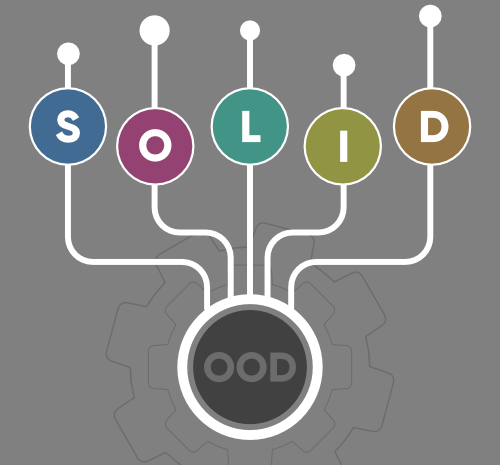

# SOLID Principles in Programming
sources: [SOLID Principles in Programming: Understand With Real Life Examples](https://www.geeksforgeeks.org/solid-principle-in-programming-understand-with-real-life-examples/)

In software development, Object-Oriented Design plays a crucial role when it comes to writing flexible, scalable, maintainable, and reusable code. There are so many benefits of using OOD but every developer should also know the SOLID principle for good object-oriented design in programming. The SOLID principle was introduced by Robert C. Martin, also known as Uncle Bob and it is a coding standard in programming. This principle is an acronym of the five principles which are given below:

- Single Responsibility Principle (SRP)
- Open/Closed Principle
- Liskov’s Substitution Principle (LSP)
- Interface Segregation Principle (ISP)
- Dependency Inversion Principle (DIP)

SOLID-Principle-in-Programming-Understand-With-Real-Life-Examples
The SOLID principle helps in reducing tight coupling. Tight coupling means a group of classes are highly dependent on one another which you should avoid in your code.

Opposite of tight coupling is loose coupling and your code is considered as a good code when it has loosely-coupled classes.
Loosely coupled classes minimize changes in your code, helps in making code more reusable, maintainable, flexible and stable. Now let’s discuss one by one these principles…

1. Single Responsibility Principle
   This principle states that “A class should have only one reason to change” which means every class should have a single responsibility or single job or single purpose. In other words, a class should have only one job or purpose within the software system.

Let’s understand Single Responsibility Principle using an example:

> Imagine a baker who is responsible for baking bread. The baker’s role is to focus on the task of baking bread, ensuring that the bread is of high quality, properly baked, and meets the bakery’s standards.

- However, if the baker is also responsible for managing the inventory, ordering supplies, serving customers, and cleaning the bakery, this would violate the SRP.
- Each of these tasks represents a separate responsibility, and by combining them, the baker’s focus and effectiveness in baking bread could be compromised.
- To adhere to the SRP, the bakery could assign different roles to different individuals or teams. For example, there could be a separate person or team responsible for managing the inventory, another for ordering supplies, another for serving customers, and another for cleaning the bakery.

2. Open/Closed Principle

This principle states that “Software entities (classes, modules, functions, etc.) should be open for extension, but closed for modification” which means you should be able to extend a class behavior, without modifying it.

Let’s understand Open/Closed Principle using an example:

>Imagine you have a class called PaymentProcessor that processes payments for an online store. Initially, the PaymentProcessor class only supports processing payments using credit cards. However, you want to extend its functionality to also support processing payments using PayPal.

Instead of modifying the existing PaymentProcessor class to add PayPal support, you can create a new class called PayPalPaymentProcessor that extends the PaymentProcessor class. This way, the PaymentProcessor class remains closed for modification but open for extension, adhering to the Open-Closed Principle.

3. Liskov’s Substitution Principle

The principle was introduced by Barbara Liskov in 1987 and according to this principle “Derived or child classes must be substitutable for their base or parent classes“. This principle ensures that any class that is the child of a parent class should be usable in place of its parent without any unexpected behavior.

Let’s understand Liskov’s Substitution Principle using an example:

> One of the classic examples of this principle is a rectangle having four sides. A rectangle’s height can be any value and width can be any value. A square is a rectangle with equal width and height. So we can say that we can extend the properties of the rectangle class into square class.

